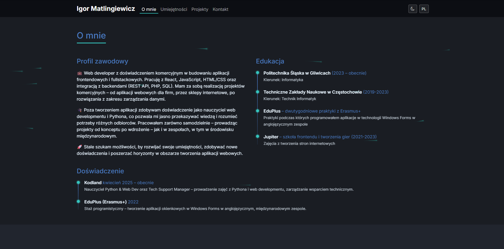

# Igor Matlingiewicz – Portfolio

Personal portfolio website showcasing my experience, skills and projects as a web developer.

## Live site

[matlingiewicz-dev.netlify.app](https://matlingiewicz-dev.netlify.app)

## Tech stack

- React + Vite
- Bootstrap 5 / React-Bootstrap
- SCSS
- AOS (Animate On Scroll)
- Netlify (hosting + form handling)

## Features

- Dark / light mode toggle
- PL / EN language switch
- Contact form with Netlify Forms
- Responsive design
